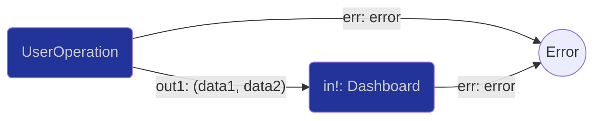

# Test Mermaid Links

```mermaid
flowchart LR
    user("UserOperation")
    dash("in!: Dashboard")
    err(("Error"))

    user -- out1: (data1, data2) --> dash
    user -- err: error --> err
    dash -- err: error --> err

    click dash "https://google.com" _blank
    click user "../README.md" _blank
    classDef blue fill:#239,color:#ccc;
    class user blue
    class dash blue
```