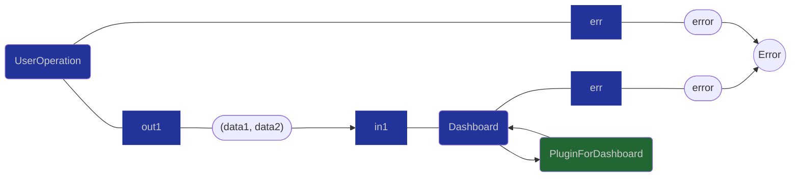

# Test Mermaid Links

```mermaid
flowchart LR
    user("UserOperation")
    user_out1["out1"]
    user_data(["(data1, data2)"])
    user_err["err"]
    user_error(["error"])
    dash("Dashboard")
    dash_in1["in1"]
    dash_err["err"]
    dash_error(["error"])
    dash_plug1("PluginForDashboard")
    err(("Error"))

    dash --> dash_plug1 --> dash
    user --- user_out1
    user_out1 --- user_data ---> dash_in1
    dash_in1 --- dash
    dash --- dash_err
    dash_err --- dash_error --> err
    user --- user_err
    user_err --- user_error --> err

    classDef comp fill:#239,color:#ccc;
    classDef port fill:#239,color:#ccc,stroke-width:0;
    classDef plugin fill:#263,color:#ccc;
    class user comp
    class user_out1 port
    class user_err port
    class dash_in1 port
    class dash comp
    class dash_err port
    class dash_plug1 plugin
```

#### Components:
* [Dashboard](../README.md)

#### Data:
* [Data1](../README.md)
* [Data2](https://google.com)